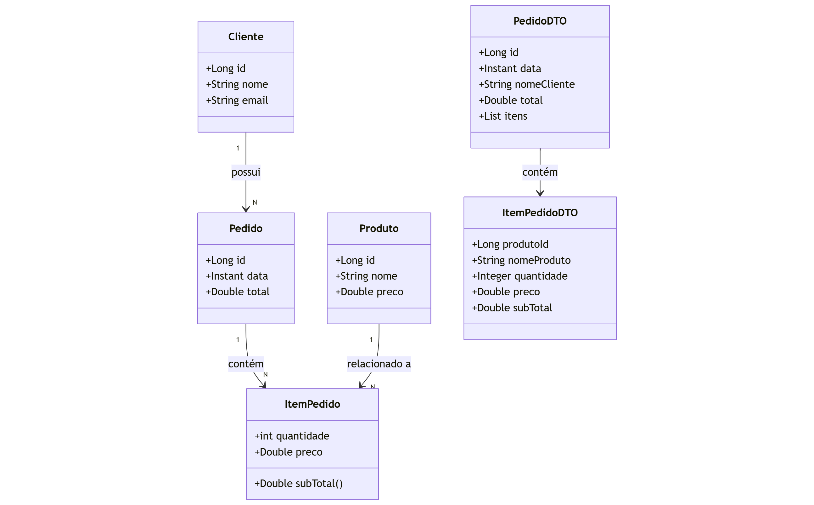

# 🛒 Mini E-commerce - Spring Boot API

Este é um projeto backend de um sistema de mini e-commerce, desenvolvido com **Java + Spring Boot**, utilizando boas práticas como o uso de **DTOs**, **tratamento de exceções global**, **camadas separadas (Controller, Service, Repository)** e persistência de dados com **JPA/Hibernate** e banco de dados H2.

---

## 📝 Diagrama Básico

## 🚀 Tecnologias e Ferramentas

- Java 17+
- Spring Boot
- Spring Data JPA
- Lombok
- H2 Database (banco em memória)
- Postman (testes dos endpoints)
- Git e GitHub

---

## ✅ Funcionalidades Implementadas

- Cadastro e listagem de **clientes**
- Cadastro de **produtos**
- Registro de **pedidos**
- Associação de **itens de pedido** (produto + quantidade)
- Cálculo automático do **subtotal e total** de um pedido
- Exceções tratadas de forma global (404, 400, etc.)
- Uso de DTOs para proteger os dados expostos

---

## 📂 Endpoints principais

| Método | Rota                 | Descrição                      |
|--------|----------------------|--------------------------------|
| GET    | /clientes            | Lista todos os clientes        |
| POST   | /clientes            | Cria um novo cliente           |
| GET    | /produtos            | Lista todos os produtos        |
| POST   | /produtos            | Cria um novo produto           |
| POST   | /pedidos             | Cria um novo pedido            |
| GET    | /pedidos/{id}        | Busca um pedido por ID         |
| DELETE | /pedidos/{id}        | Remove um pedido               |

---

## 🗃️ Banco de Dados
Utilizado H2 Database (acessível em: http://localhost:8080/h2-console)

Configuração em application.properties

Dados populados automaticamente ao iniciar a aplicação (via TestConfig)

## 👨‍💻 Autor
Victor da Costa Almada
Estudante apaixonado por tecnologia, em transição de carreira para a área de desenvolvimento.
Bootcamps: Backend Java, Spring, Banco de Dados, etc.
LinkedIn: [Victor Almada](https://www.linkedin.com/in/victor-almada/)
